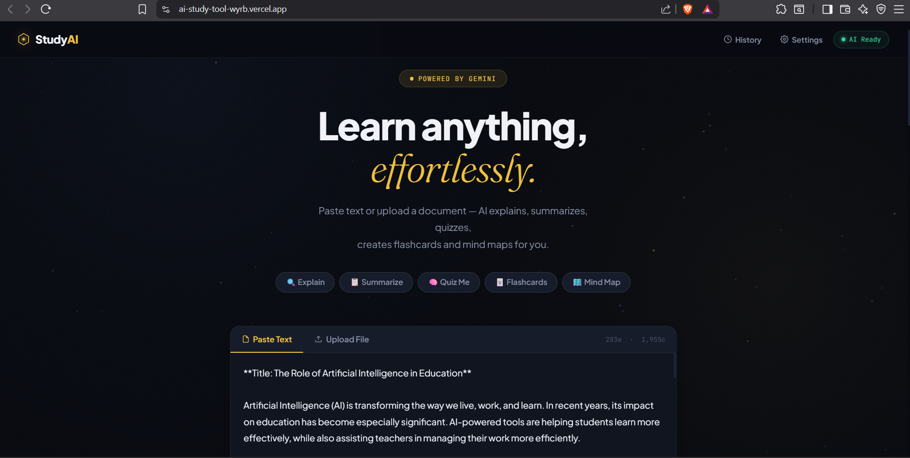
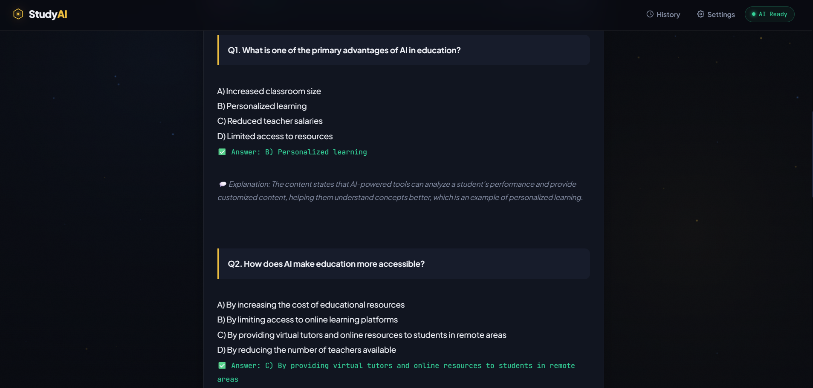
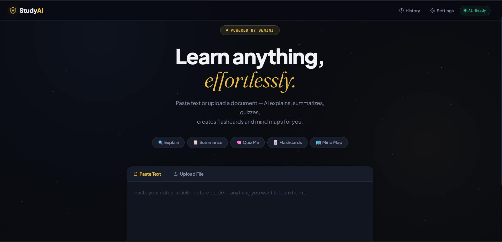

# ⚡ AI Study Tool

An AI-powered study assistant that helps you **understand, summarize, and test your knowledge instantly**.
Upload or paste content — get explanations, summaries, and quizzes in seconds.

---

## 🌐 Live Demo

* 🚀 **App:** https://ai-study-tool-wyrb.vercel.app/
* 👨‍💻 **Portfolio:** https://mrabhi-7208.netlify.app/

---

## ✨ Features

* 📝 Paste text (notes, articles, code)
* 📁 Upload files (PDF, TXT, CSV, JSON)
* 🔍 Explain complex content in simple terms
* 📋 Generate clean summaries
* 🧠 Auto-create quizzes
* 💡 Smart follow-up suggestions
* 🔁 Reliable AI response system

---

## 📸 Screenshots

<p align="center">
  
  
  
</p>

---

## 🧱 Tech Stack

* Frontend: HTML, CSS, JavaScript
* Backend: FastAPI (Python)
* AI Integration: Modern LLM APIs
* Deployment: Cloud-based hosting

---

## 📁 Project Structure

```id="str1"
ai-study-tool/
├── Backend/
├── frontend/
├── Screenshots/
└── README.md
```

---

## 🚀 Getting Started (Local)

### Backend

```bash id="str2"
cd Backend
pip install -r requirements.txt
uvicorn main:app --reload
```

### Frontend

```bash id="str3"
cd frontend
open index.html
```

---

## 📡 API Overview

* `POST /process-text` → Explain / Summarize / Quiz
* `POST /upload-file` → Process uploaded files

---

## ⚠️ Notes

* Free hosting may cause slight delay on first request
* Some complex files may take longer to process

---

## 📜 License

MIT License

---

## ⭐ Support

If you found this useful, consider giving it a ⭐ on GitHub!
